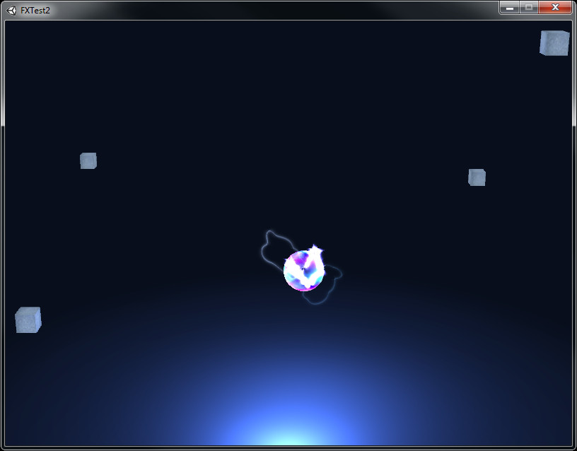
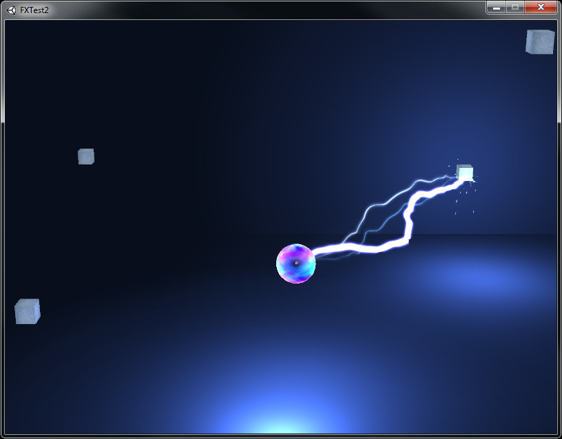
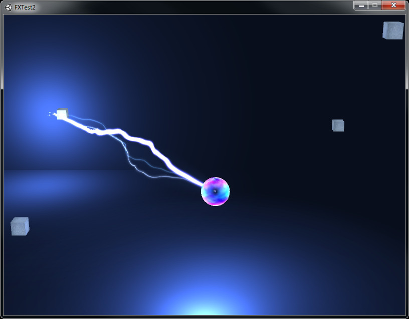

# Lightning-FX-Unity
A lightning effect demo I built in the Unity3D

The little ball in the center is just pulsing with electricity. You have only to click somewhere on the screen to send the electricity arching forth. If you have the Unity3D web player you can play around with the [demo](http://random-features.net/fxtest/)

